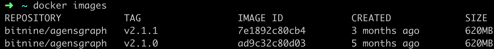
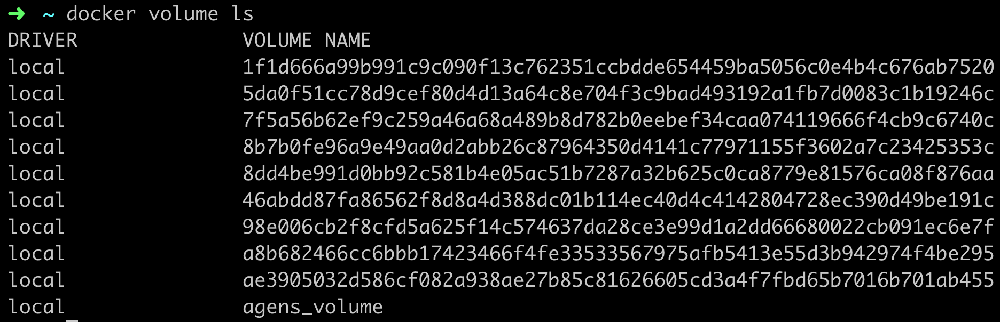
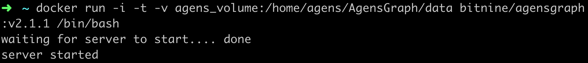
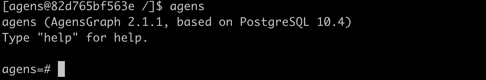
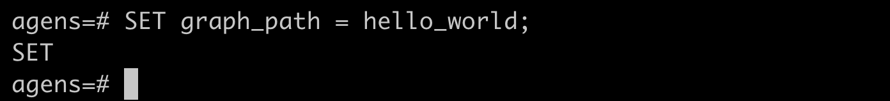
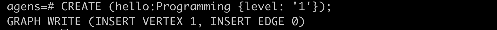
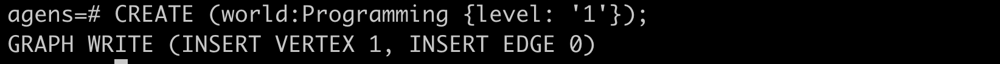
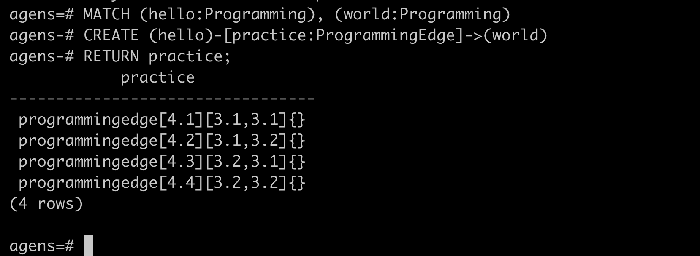

## AgensGraph 도커 컨테이너에 접속하기

국내 유일의 GraphDatabase인 AgensGraph는 도커를 지원한다.
<br>[AgensGraph 도커 리포지토리](https://hub.docker.com/r/bitnine/agensgraph)

AgensGraph를 사용하기 위해 도커 이미지를 받는다.
```code
docker pull bitnine/agensgraph:v2.1.1
```


AgensGraph 컨테이너와 로컬에서 데이터 공유를 할 도커 볼륨을 하나 만든다. 
```code
docker volume create --name agens_volume
```


AgensGraph 이미지를 /bin/bash 명령어로 실행한다.
```code
docker run -i -t -v agens_volume:/home/agens/AgensGraph/data bitnine/agensgraph:v2.1.1 /bin/bash
```


AgensGraph 컨테이너에 접속 후 'agens'라는 명령어를 입력하면 AgensGraph에 접속하게 된다.



## 간단한 cyhper 쿼리 사용해보기

'hello_world'라는 그래프를 만든다.
```code
CREATE GRAPH hello_world;
```


만들어진 'hello_world' 그래프를 사용하기 위해 경로 설정을 해야한다.
```code
SET graph_path = hello_world;
```


'hello'라는 노드를 만든다. hello는 노드 이름, Programming은 라벨 이름, level은 프로퍼티이다.
```code
CREATE (hello:Programming {level: '1'});
```


마찬가지로 'world'라는 노드도 만든다.
```code
CREATE (world:Programming {level: '1'});
```


다음으로 hello 노드와 world 노드 사이에 'practice'라는 관계(edge)를 만들자.
```code
MATCH (hello:Programming), (world:Programming)
CREATE (hello)-[practice:ProgrammingEdge]->(world)
RETURN practice;
```

